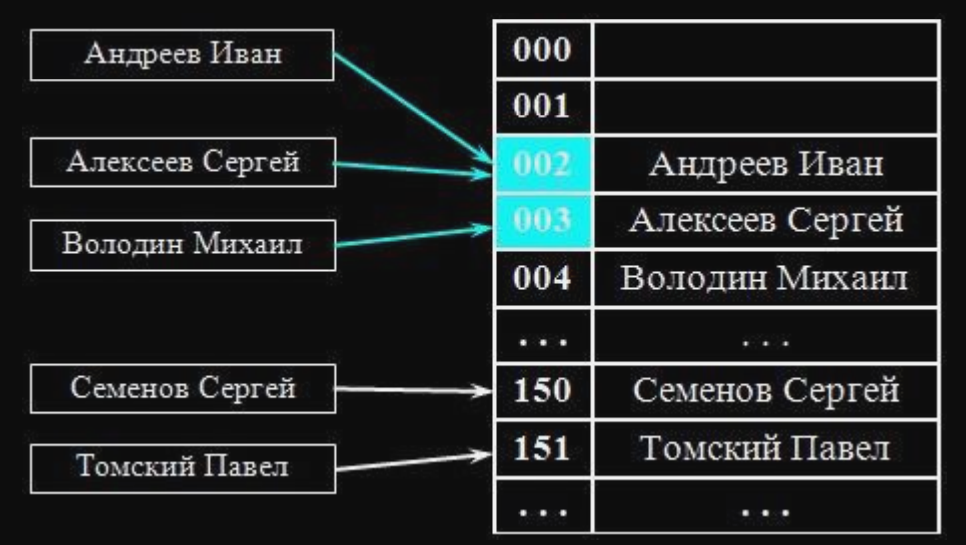
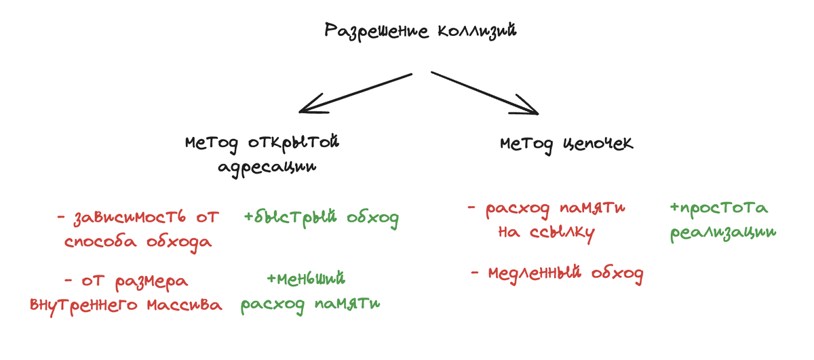

### Подробный разбор задач


<details>
<summary>Задача №1 (concurrency)</summary>

### Что выведет программа?

```go
func main() {
	for _, val := range []int{1, 2, 3} {
		go println(val)
	}
}
```

### Отсутствие вывода

Программа не выводит ничего на экран. Это происходит потому, что основная горутина `main` завершается раньше, чем горутины успевают выполнить `println`. В результате, программа завершает работу, не дождавшись завершения всех запущенных горутин.

### Использование `WaitGroup`

Чтобы гарантировать, что все горутины завершат выполнение, прежде чем программа выйдет, необходимо использовать примитив синхронизации `sync.WaitGroup`. Этот механизм позволяет основной горутине `main` ожидать завершения всех запущенных горутин.

### Захват переменной в замыкании

В зависимости от версии Go, необходимость добавления новой переменной для захвата значения в замыкании может изменяться. Начиная с версии 1.22, дополнительная переменная не обязательна, так как компилятор Go сам обрабатывает захват переменных в контексте горутин.

### Решение

```go
func main() {
	wg := sync.WaitGroup{}
	for _, val := range []int{1, 2, 3} {
		wg.Add(1)
		go func(num int) {
			defer wg.Done()
			println(num)
		}(val)
	}
	wg.Wait()
}
```

</details>
<br>


<details>
<summary>Задача №2 (concurrency)</summary>

### Что выведет программа?

```go
func main() {
	ch := make(chan string)
	close(ch)
	go func() {
		text := <-ch
		println("Hello, ", text)
	}()
	runtime.GC()
}
```

### Вывод программы

Программа выведет: `Hello, `. Это происходит из-за того, что из закрытого канала читается zero value (пустая строка для типа `string`), которая и будет выведена.

### Что происходит в программе?

1. **Создание канала**: Программа создает канал для строк: `ch := make(chan string)`.
   
2. **Закрытие канала**: На следующей строке канал закрывается с помощью `close(ch)`. Закрытие канала предотвращает запись в него, но чтение все еще возможно.

3. **Горутина**: Запускается горутина, которая читает из канала. Поскольку канал закрыт, операция чтения возвращает zero value для типа `string` — пустую строку. Это значение используется в `println`, формируя вывод `Hello, `.

4. **Использование `runtime.GC()`**: Вызывается сборщик мусора `runtime.GC()`, который служит для того, чтобы дать время горутине завершить выполнение.


</details>
<br>

<details>
<summary>Задача №3 (string)</summary>

### Что выведет программа?

```go
func main() {
	println(f())
}

func f() string {
	s := "Test"
	s[0] = 'R'
	return s
}
```

### Вывод программы

Попытка изменить строку `s` с помощью `s[0] = 'R'` вызовет ошибку компиляции. Это связано с тем, что строки в Go являются неизменяемым (immutable) типом данных. Прямое изменение символов строки недопустимо.

### Доработка программы

Чтобы программа корректно работала необходимо изменить подход к изменению строки. Поскольку строки в Go являются неизменяемыми (immutable), требуется преобразовать строку в массив байтов, внести необходимые изменения, а затем преобразовать массив обратно в строку.

### Решение

```go
func main() {
	println(f())
}

func f() string {
	s := "Test"
	b := []rune(s) // Преобразуем строку в срез рун
	b[0] = 'R'     // Изменяем первый элемент
	return string(b) // Преобразуем обратно в строку
}
```

</details>
<br>

<details>
<summary>Задача №4 (string)</summary>

### Как посчитать количество символов в строке?

```go
func main() {
	str := "Привет!"
	charCount := 0
	// посчитать кол-во символов в строке
	if charCount == 7 {
		println("Success!")
	}
}
```

#### Подсчет символов №1

Самый простой способ подсчитать количество символов в строке — это пройтись по ней в цикле и инкрементировать счетчик с каждой итерацией. Это позволяет корректно учитывать символы, которые занимают более одного байта.

### Решение №1

```go
func main() {
	str := "Привет!"
	charCount := 0

	// Посчитать количество символов в строке
	for range str {
		charCount++
	}

	if charCount == 7 {
		println("Success!")
	}
}
```

#### Подсчет символов №2

Преобразовав строку в срез рун с помощью []rune(str), мы можем работать с каждым символом как с отдельной Unicode-кодовой точкой, и функция len() затем возвращает количество рун, что соответствует количеству символов в строке.

### Решение №2

```go
func main() {
	str := "Привет!"
	charCount := 0

	// Посчитать количество символов в строке
	charCount = len([]rune(str)) // Преобразуем строку в срез рун и берем его длину

	if charCount == 7 {
		println("Success!")
	}
}
```


#### Почему нельзя использовать `len(str)`?

Если использовать `len(str)`, то вы получите количество байт в строке, а не количество символов. В данном случае строка `"Привет!"` содержит русские символы, которые занимают 2 байта каждый. Поэтому `len(str)` вернет 13, а не 7.

### Что такое руна? Какой размер она имеет?

- **Руна (rune)** — это тип данных в Go, представляющий собой Unicode-кодовую точку. По сути, руна — это просто `int32`, который используется для обозначения символов Unicode.
- **Размер руны**: Руна в Go имеет размер 4 байта (32 бита). Это позволяет ей хранить любую Unicode-кодовую точку, так как диапазон Unicode охватывает значения от 0 до 0x10FFFF, что помещается в 32-битное целое число.


</details>
<br>

<details>
<summary>Задача №5 (string)</summary>

### Что выведет программа?

```go
func main() {
	str := "Привет"
	for i := range str {
		println(i)
	}
}
```

### Вывод программы

Программа выведет следующие индексы:

```
0
2
4
6
8
10
```

Эти индексы появляются потому, что русские буквы в кодировке UTF-8 кодируются двумя байтами. В цикле `for i := range str`, переменная `i` представляет собой байтовый индекс каждого символа в строке.


</details>
<br>

<details>
<summary>Задача №6 (slice)</summary>

### Что такое слайс? Почему он так называется?

Слайс - динамически расширяемый массив, который может расширятся с помощью функции append.

#### Структура слайса

```go
type SliceHeader struct {
    Data uintptr
    Len  int
    Cap  int
}
```


- **Pointer**: `*array` — базовый массив.
  - Ссылка указывает на первый элемент массива.
  - Последний используемый элемент определяется с помощью `Length`.

- **Length**: `int`
  - Это количество элементов, которые мы "отщипываем" от базового массива.

- **Capacity**: `int`
  - Это количество элементов, которые могут поместиться в базовый массив, учитывая, что первый элемент слайса не обязательно совпадает с первым элементом массива.
  - Например, если размер массива 10, но мы начинаем использовать его с 5-го элемента, то `capacity` будет 5.

### Как работает функция append?

1. **Для слайсов до 256 элементов:**
   - Емкость увеличивается в два раза. Это позволяет эффективно управлять памятью и минимизировать количество операций по перераспределению памяти.

2. **Для слайсов более 256 элементов:**
   - Емкость увеличивается по формуле: 
     
   - Здесь константа равна 256. Этот подход позволяет более плавно увеличивать емкость, что особенно важно для больших слайсов, чтобы избежать резкого увеличения использования памяти.


### Что выведет программа?

```go
func main() {
	slice := make([]int, 0, 1000)
	slice = append(slice, 1, 2, 3)
	fmt.Println(slice)     // ???
	process(slice)
	fmt.Println(slice)     // ???
	fmt.Println(slice[:6]) // ???
}

func process(slice []int) {
	for index := range slice {
		slice[index] = 0
	}
}
```

### Вывод программы

1. **Первый вывод: `fmt.Println(slice)`**  
   - Вывод: `[1 2 3]`
   - Изначально в слайс добавляются элементы 1, 2 и 3.

2. **Второй вывод: `fmt.Println(slice)` после `process(slice)`**  
   - Вывод: `[0 0 0]`
   - Функция `process(slice)` заменяет каждый элемент слайса на 0, изменяя его на месте.

3. **Третий вывод: `fmt.Println(slice[:6])`**  
   - Вывод: `[0 0 0 0 0 0]`
   - Слайс изначально создан с длиной 0 и емкостью 1000, поэтому `slice[:6]` имеет доступ к первым шести элементам подлежащего массива. Так как `process(slice)` изменяет только первые три элемента, остальные элементы остаются нулевыми, и выводится `[0 0 0 0 0 0]`.


</details>
<br>

<details>
<summary>Задача №7 (slice)</summary>

### Что выведет программа?

```go
func main() {
	slice := make([]int, 0, 1000)
	slice = append(slice, 1, 2, 3)
	fmt.Println(slice)     // ???
	process(slice)
	fmt.Println(slice)     // ???
	fmt.Println(slice[:6]) // ???
}

func process(slice []int) {
	slice = append(slice, 4, 5, 6)
}
```

### Вывод программы

1. **Первый вывод: `fmt.Println(slice)`**  
   - Вывод: `[1 2 3]`
   - Изначально в слайс добавляются элементы 1, 2 и 3.

2. **Второй вывод: `fmt.Println(slice)` после `process(slice)`**  
   - Вывод: `[1 2 3]`
   - В функции process(slice) создается новый слайс с добавлением элементов 4, 5 и 6. Однако это изменение не влияет на оригинальный слайс в main, так как слайсы передаются по значению, где копируются длина и емкость, но базовый массив передается по указателю. Поэтому при выходе из функции process длина оригинального слайса остается прежней.

3. **Третий вывод: `fmt.Println(slice[:6])`**  
   - Вывод: `[1 2 3 4 5 6]`
   - Функция `process(slice)` изменяет оригинальный слайс, добавленные элементы 4, 5 и 6 все же записываются в подлежащий массив, так как у слайса достаточно емкости (1000). Указав явно длину `slice[:6]` мы можем включить эти элементы в вывод.

</details>
<br>

<details>
<summary>Задача №8 (map)</summary>

### Что такое мапа в го?

Мапа - это структура данных, которая содержит в себе пару ключ и значение.
Под капотом в ней хеш-таблица, которая позволяет нам обращаться по ключу за константное время.

Изначально создается мапа с 8 бакетами.
Бакет - структура данных, в которой хранится ключи и значения в мапе. Данные внутри бакета хранятся в виде массива, в одном бакете может быть до 8 элементов. Если все аллоцированые бакеты в среднем заполнены на 6,5, то начинается эвакуация данных.
Важное свойство для ключа - он должен быть comparable (сравнимый).
Нельзя взять указатель на элемент мапы как раз по причине эвакуации данных. Бакеты нужно для равномерного распределения данных.

#### Структура map
1) count - размер мапы
2) B - log_2 (логарифм) количества бакетов. Для 8 бакетов B=3, для 16 B=4 и так далее.
3) hash0     uint32 // seed для хэш-функции, генерируется при создании мапы. нужен для рандомизации хэш-функции
4) buckets    unsafe.Pointer // ссылка на массив из 2^B бакетов; nil, если count==0
5) oldbuckets unsafe.Pointer // ссылка на массив предыдущих бакетов. в процессе роста мапы здесь будет массив старых бакетов, откуда потихоньку будут переноситься значения в новые бакеты.

#### Переполнение бакета.
При переполнении бакета создается новый бакет и ссылка не него сохраняется в старом бакете. Ситуация переполнения бакета очень нежелательна.
Цифра 6.5 взято не случайно - это "идеальное" сочетание между переполнением и необходимым выделением памяти.
Похоже при этом эвакуация данных не происходит, просто создается еще один новый бакет. Этот процесс не быстрый, память выделяется, но она не инициализируется сразу. Если бы мы переносили данные сразу, после того, как выделили память, то некоторые операции внезапно начали бы работать медленно. Поэтому операции переноса выполняются в те моменты, когда мы выполняем операции сохранения или удаления ключей из мапы, это выполняется инкрементально. В ходе этого процесса данные равномерно распределяются по новым бакетам. Мы избежали пауз в выполнении операций, но теперь эти операции будут работать медленнее, потому что в момент эвакуации нужно будет смотреть в старые и в новые бакеты. Единственный способ избежать этих проблем выделять память для мапы под нужный размер заранее.

#### Эвакуация
Из-за эвакуации мы не можем взять указатель под элемент мапы. Компилятор не дает этого сделать. Потому что, если мы и возьмем указатель на элемент мапы, то после эвакуации данных указатель уже будет неактуальным - данные уже будут лежать в другом бакете и в другой ячейке памяти.

Эвакуация данных из бакета
Создается новый список бакетов, который будет в 2 раза больше чем предыдущий. И данные из старых бакетов будут скопированы в новые.

Эвакуация - процесс реорганизации и перераспределения элементов из старых корзин в новые корзины при расширении хеш-таблицы. Она происходит, когда количество элементов в map превышает определенный порог, происходит увеличение числа корзин, чтобы уменьшить вероятность коллизий и сохранить эффективность операций вставки, удаления и поиска. При увеличении 
Эвакуация происходит не сразу, только при чтении или записи к ним.
Эвакуация происходит через воркеры.

Записывать значения в неинициализированную мапу нельзя, будет паника.
Читать значения из неинициализированную мапу можно, получим zero-value.

### У нас есть хеш-функция, которая возвращает нам какой-то хеш. Хеш представляет из себя значение числа int64. Бакетов у нас меньше? Как вычислить в какой бакет положить пару ключ-значение?

Мы берем остаток от деления от количества бакетов.

### Что выведет программа?

```go
func main() {
	var m map[string]struct{}
	for k := range m {
		println(k)
	}
	println("end!")
}
```

Поскольку карта пуста и не содержит элементов для итерации, единственным выводом будет `"end!"`.

</details>
<br>

<details>
<summary>Задача №9 (map)</summary>

### У нас есть 2 функции для вычисления хеша. Нужно вставить в мапу всего лишь 10 элементов.
### Какая функция для вычисления хеша больше подходит для этой цели? Какие плюсы и минусы каждой функции?

```go
func hash1() int {
	return randomInt(100)
}

func hash2() int {
	return 1
}
```

Функция `hash1` каждый раз возвращает случайный хеш. Это обеспечивает равномерное распредление по бакетам при вставке элементов в мапу. Только при чтении мы уже не сможем обратиться в тот бакет, в который положили наше значение, потому что хэш-функция вернет другое значение. Здесь происходит нарушение детерменированности и предскауемости хэш-функции.

Функция `hash2` всегда возвращает единицу. Это значит, что в мапе у нас будет 10 элементов, которые будут иметь одинаковые хеши, будет возникать большое количество коллизий. Все элементы мапы будут хранится в одном бакете. С такой функцией вычисления мапы мы получаем массив. Сложность получения элементов в худшем случае будет O(n). Функция `hash2` в отличии от `hash1` детерминированна, что является плюсом.

### Что такое коллизия?

Коллизия — это ситуация при которой два разных входных элемента (ключа) дают одинаковое хеш-значение. При этом оба ключа будут помещены в один и тот же бакет в хеш-таблице. Существуют несколько методов решения коллизий. Чаще всего на собеседованиях упомниваются два нижеуказанных метода.

### Какие методы используются для решения коллизий и какой метод используется в го?

Методы решения коллизий:

#### 1. Метод открытой адресации.


Элементы мапы хранятся в массиве. При коллизии происходит поиск следующей свободной ячейки и вставка в нее элемента.

#### 2. Метод цепочек (применяется в го).



В ячейках массива хранятся не элементы мапы, а указатели на связный список, который хранит все элементы с одинаковым хешем. В случае коллизии новый элемент добавляется в этот список.



</details>
<br>

<details>
<summary>Задача №10 (interface)</summary>

### Что такое интерфейсы в го?

Интерфейсы — (контракт) это инструменты для определения наборов действий и поведения. Они позволяют объектам опираться на абстракции, а не фактические реализации других объектов.

В структуре itab хранится тип интерфейса и методы, которые должна описывать структура, чтобы реализовывать интерфейс:

```go
type iface struct {  
    tab  *itab             // это указатель на Interface Table или itable - структуру, которая хранит список методов, используемых для удовлетворения интерфейса.
    data unsafe.Pointer    // указатель на тип данных  
}  
```

Интерфейсы широко используются при тестировании.

Где необходимо объявлять интерфейс? Там где мы его используем? Или там где мы его реализуем?

Интерфейсы:
1. Описываются там, где используется.
2. Должны содержать только то, что используется

### Что выведет программа?

```go
func main() {
	var ptr *struct{}
	var iface interface{}
	iface = ptr
	if iface == nil {
		println("It's nil!")
	}
} 
```

Ничего не распечается потому что `interface != nil`, в нем хранится информация о типе данных (`struct{}` - пустая структура).
Если убрать присвоение `iface = ptr`, то интерфейс станет равным `nil`.


</details>
<br>

<details>
<summary>Задача №11 (defer)</summary>

### Что такое defer?

Ключевое слово `defer` позволяет отложить выполнение функции до конца текущей функции. Это полезно для выполнения операций очистки, таких как закрытие файлов или освобождение ресурсов, независимо от того, как функция завершилась (нормально или с ошибкой).

Если в функции несколько отложенных вызовов, они будут выполнены в обратном порядке их объявления (стековый порядок).

### Что и почему напечатает программа?

```go
func f1() int {
    x := 1
    defer func() {
        x += 1
    }()
    return x
}
```

```go
func f2() (x int) {
    x = 1
    defer func() {
        x += 1
    }()
    return x
}
```

В функции `f1` переменная `x` является локальной. defer изменяет `x` после того, как выполняется `return x`. Однако, поскольку `x` является локальной переменной и не участвует в процессе возврата, возвращаемое значение равно значению `x` на момент выполнения `return`. Функция `f1` возвращает `1`.

В `f2` функции переменная `x` является именованной возвращаемой переменной. defer изменяет `x` после того, как выполняется `return`, но до того, как функция фактически вернет значение. Это происходит потому, что именованная возвращаемая переменная `x` участвует в процессе возврата. Функция `f2` возвращает `2`.

</details>
<br>

<details>
<summary>Задача №12 (error)</summary>

### Реализовать функцию, которая возвращает ошибку, не используя импорт других библиотек

```go
type myError struct {}

func (e *myError) Error() string {
	return "my error"
}

func handle() error {
	return &myError{}
}

func main() {
	err := handle()
	if err != nil {
		println(err.Error())
	}
}
```

1. Создаем собственную структуру ошибки `myError`.
2. Реализуем интерфейс `error` с помощью метода `Error()`, который возвращает `string`. Это необходимо, чтобы `myError` удовлетворял интерфейсу `error`, который требует удовлетворения единственного метода `Error()`, который возвращает `string`.
3. Функция `handle()` имитирует работу обычной функции, которая возвращает ошибку. Она возвращает указатель на экземпляр `myError`. Поскольку `myError` реализует интерфейс `error`, функция `handle()` возвращает значение типа `error`.
4. В `main`, происходит вызов функции `handle()` точно также, как мы обычно вызываем любую другую функцию с возвратом ошибки. После проверки на `nil`, мы распечатываем ошибку. В нашем случае, у нас всегда ошибка не равна `nil`, и мы распечатываем `my error`.


</details>
<br>

<details>
<summary>Задача №21 (merge-channels)</summary>

### Задача на слияние каналов

В этой задаче требуется написать функцию, которая объединяет несколько входных каналов в один выходной канал. 

```go
const N = 5

func main() {
	in := make([]chan int, 0)
	for i := 0; i < N; i++ {
		in = append(in, make(chan int))
	}

	wg := sync.WaitGroup{}

	wg.Add(1)
	go func() {
		cc := make([]<-chan int, 0)
		for _, c := range in {
			cc = append(cc, c)
		}
		for v := range merge(cc...) {
			fmt.Println(v)
		}
		wg.Done()
	}()

	wg.Add(1)
	go func() {
		for i := 0; i < 20; i++ {
			in[i%N] <- i
		}
		for _, c := range in {
			close(c)
		}
		wg.Done()
	}()

	wg.Wait()
}

func merge(in ...<-chan int) <-chan int {
	// Let's do a better solution
	return nil
}
```

### Что происходит в функции main?

Мы создаем несколько каналов, отправляем в них данные и затем объединяем их в один канал, из которого читаем и выводим данные.

1. **Создание каналов**: Мы создаем `N` каналов и добавляем их в срез `in`.

2. **Горутина для слияния**: В первой горутине мы создаем срез `cc` из каналов и передаем его в функцию `merge`, которая объединяет все каналы в один. Результат выводится в консоль.

3. **Горутина для отправки данных**: Во второй горутине мы отправляем числа от 0 до 19 в каналы, распределяя их по модулю `N`. После этого все каналы закрываются.

4. **Функция `merge`**: Эта функция принимает произвольное количество каналов, запускает горутину для каждого из них, которая читает данные и отправляет их в общий выходной канал `out`. После завершения всех горутин `out` закрывается.

### Решение

```go
func merge(in ...<-chan int) <-chan int {
	out := make(chan int)
	wg := &sync.WaitGroup{}
	for _, val := range in {
		wg.Add(1)
		go func(ch <-chan int) {
			defer wg.Done()
			for value := range ch {
				out <- value
			}
		}(val)
	}

	go func() {
		wg.Wait()
		close(out)
	}()
	return out
}
```

Функция `merge` принимает несколько каналов `in` и объединяет их в один выходной канал `out`.

1. **Создание выходного канала**:
   Создается канал `out`, в который будут отправляться данные из всех входных каналов.

2. **Создание группы ожидания**:
   `sync.WaitGroup` используется для ожидания завершения всех горутин, которые читают из входных каналов.

3. **Запуск горутин для каждого канала**:
   - Для каждого канала `val` из `in`, функция добавляет единицу в группу ожидания с `wg.Add(1)`.
   - Запускается горутина, которая:
     - Считывает данные из канала `ch`.
     - Отправляет каждое считанное значение в канал `out`.
     - После завершения чтения из канала, вызывает `defer wg.Done()` для уменьшения счетчика группы ожидания.

4. **Закрытие выходного канала**:
   - Запускается дополнительная горутина, которая ждет завершения всех горутин (с помощью `wg.Wait()`).
   - После завершения всех горутин, `out` закрывается. Это сигнализирует о том, что больше данных не будет отправлено в канал, и позволяет потребителю завершить чтение корректно.

5. **Возврат выходного канала**:
   - Возвращает канал `out`, который теперь объединяет данные из всех входных каналов.

</details>
<br>

<details>
<summary>Задача №22 (add-two-numbers)</summary>

### Задача из leetcode под названием "Add Two Numbers".

Здесь на вход приходят 2 неотрицательных числа в виде связного списка. Цифры хранятся в обратном порядке. Необходимо сложить 2 числа и вернуть результат в виде связного списка.

### Решение

В решении мы имитируем сложение числа в столбик. Проходимся по разрядам, складываем числа и, если полученное число больше 9, записываем оставшуюся часть в остаток `carry`. В цикле проходимся до тех пор пока у нас есть остаток или есть узлы в списках `a` и `b`. Результат возвращается в виде `head.Next`, потому что первый узел фиктивный и в нем хранится zero value - `0`, его мы пропускаем.

```go
func addTwoNumbers(a, b *ListNode) *ListNode {
	res := &ListNode{}
	head := res
	sum, carry := 0, 0
	for a != nil || b != nil || carry != 0 {
		sum = carry
		if a != nil {
			sum += a.Val
			a = a.Next
		}
		if b != nil {
			sum += b.Val
			b = b.Next
		}
		carry = sum / 10
		res.Next = &ListNode{sum % 10, nil}
		res = res.Next
	}

	return head.Next
}
```

</details>
<br>
